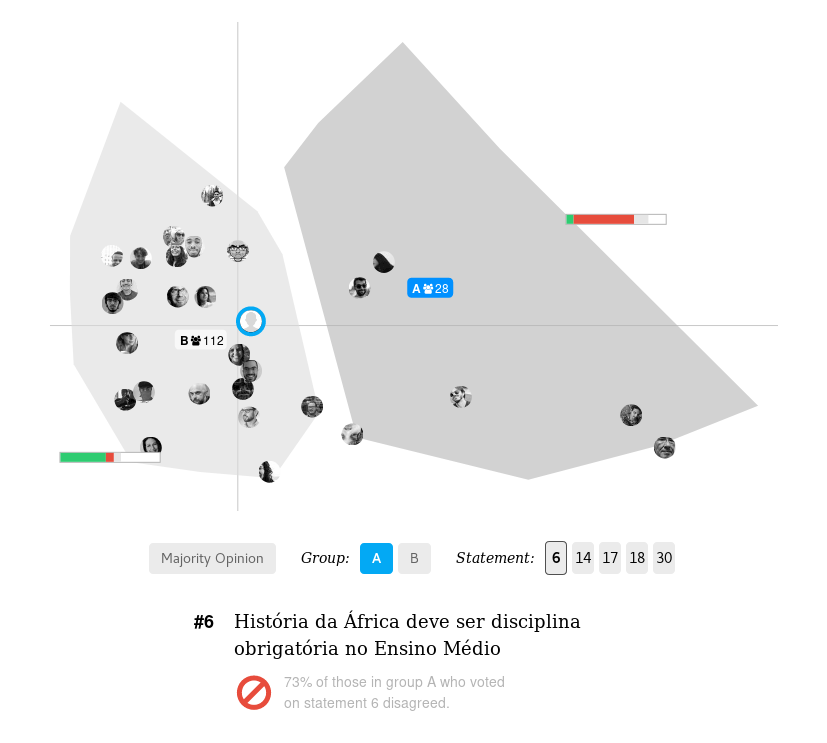
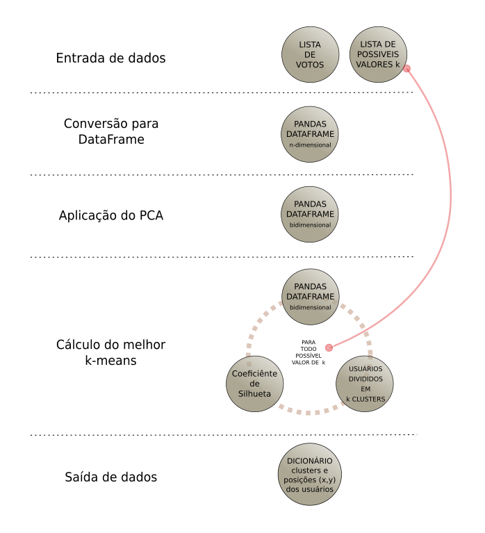
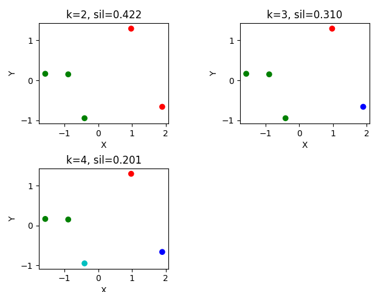
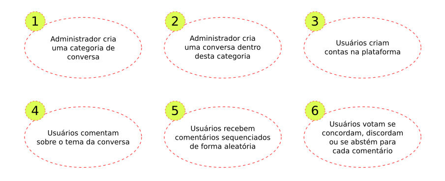
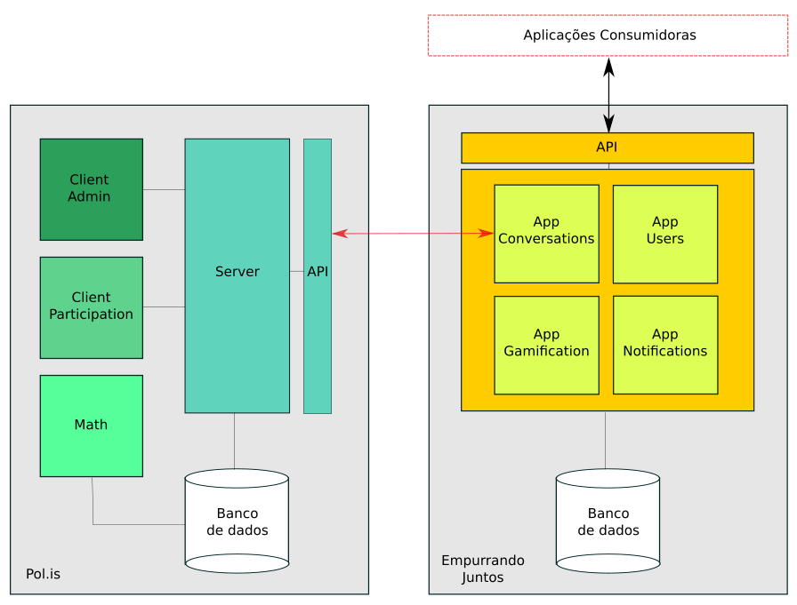
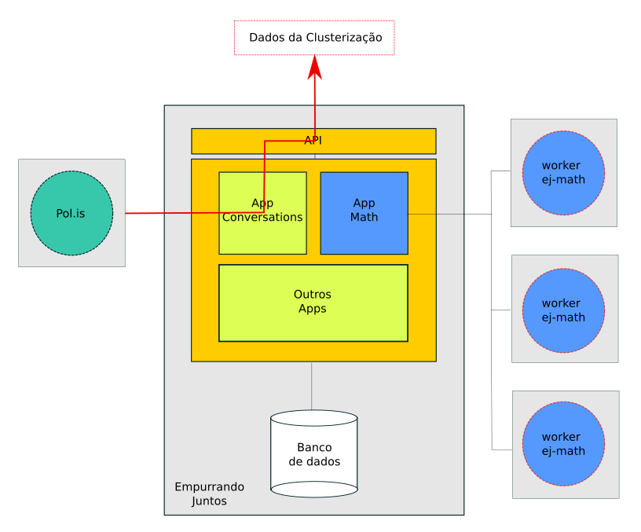
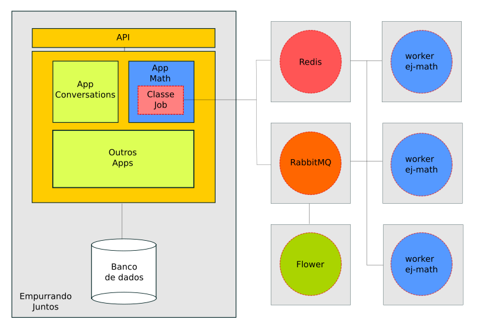
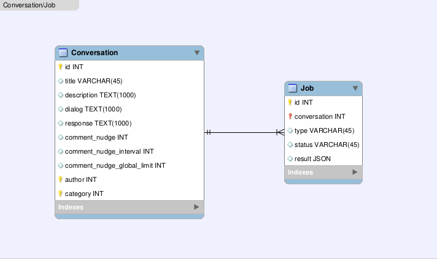

# Plataforma de participação {#sec:ej}

_Empujando Juntos_, em espanhol, foi o primeiro nome dado à plataforma de participação social baseada no modelo _crowdsource_ que permite a interação _online_ de usuários através de diálogos, comentários e votos. Pensado inicialmente pelo Institudo Cidade Democrática, uma organização não governamental brasileira, foi selecionado como uma das oito melhores propostas submetidas à primeira edição do Hackaton Inteligência Coletiva para a Democracia, em 2016, realizado nos laboratórios do ParticipaLab, em Madri, Espanha.

Neste evento, que reuniu pessoas de diversas nacionalidades, os principais conceitos sobre o que viria a ser o _software_ foram idealizados. Metodologias desenvolvidas sobre os objetivos sociais da plataforma, como intensificar os processos de participação nas redes, nasceram de diálogos interdisciplinares que evidenciaram a importancia das TICs na evolução das sociedades, e também, as limitações e potencialidades das tecnologias existentes que buscam consolidar esse papel.

## Democracia e Participação Social

No contexto brasileiro, a Constituição Federal de 1988, indicou, ainda que de maneira sucinta, que as políticas públicas a partir desta data deveriam ser realizadas em regime de gestão compartilhada, ou seja, com ampla participação da sociedade. Entretanto, os diferentes arranjos sócio-políticos, que permearam o Brasil durante as três décadas seguintes, obtiveram êxitos contestáveis, principalmente quando nos referimos à efetividade da implementação de mecanismos de participação institucionais [@roma15].

Neste período, a realidade conta que o fato ocorrido foi a intensificação da realização de formas já existentes de participação de maneira nem sempre organizada [@roma15]. Via de regra, a Constituição vigente não estabelece clara e objetivamente qual é a função das deliberações encaminhadas dos processos de participação no contexto da governança pública. Assim, tanto o Estado quanto a sociedade civil figuram em uma situação semi estática sobre a seleção de rumos e mecanismos que fomentariam um vínculo efetivo entre a opinião popular e as políticas públicas implementadas.

Observamos aqui uma dualidade entre Estado e sociedade como entidades distintas dentro do processo democrático. Seja esse o reflexo de um passado oligárquico ou não, é evidente a distinção de dois papéis e suas atribuições, assim como as expectativas de um em relação ao outro. Nesse aspécto, podemos notar que, em algum momento, o Estado pressupôs que o ambiente democrático pós-ditadura incentivaria gradualmente o engajamento e a autonomia da sociedade como o seu próprio agente aprimorador [@roma15]. Assim, os governos seriam obrigados a deliberar em conjunto com uma população autiva e interessada nos caminhos a serem seguidos na constante evolução da democracia.

O fracasso de tal ideal não seria maior se nesse curto tempo não tivéssemos nos deparado com as modernas TICs, que revolucionaram o potencial de articulação não apenas da sociedade civil brasileira, mas do mundo inteiro, através da _Internet_. Com 1,65 bilhão de usuários ativos (medidos em 2016) a plataforma de mídias sociais do Facebook é a principal esfera pública digital para boa parte das pessoas conectadas à internet [@joao18]. Com seus 14 anos de desenvolvimento, é uma das principais influências de grande parte de uma nova geração de redes sociais digitais.

Embora sejamos capazes de associar, ao Facebook, uma inerente capacidade de impulsionar o processo de participação democrática a nível mundial, devemos ponderar sobre vários de seus objetivos de negócio, que refletem um contraponto importante a esse processo. Para proporcionar o melhor retorno possível aos seus anunciantes, as plataformas massivas de mídias sociais utilizaram e desenvolveram diversas técnicas de coleta de dados pessoais e reconhecimento de padrões, buscando inferir o máximo de informações sobre os comportamentos de seus usuários. Desta forma, pode-se proporcionar uma experiência personalizada de visualização de conteúdos e anúncios, aumentando o tempo médio de utilização dessas ferramentas [@joao18].

Forma-se um ciclo em que os dados de um usuário são colhidos, o seu padrão de comportamento é extraído a partir deles, e então, a ferramenta proporciona uma experiência personalizada. Neste cenário, o usuário utiliza a ferramenta por mais tempo, mais dados são coletados, e assim, a cada ciclo, os algoritmos refinam a inteligência sobre o indivíduo. Podemos observar uma forte tendência para o reforço e manutenção de padrões de comportamento já conhecidos através do refinamento das experiências individuais ao longo do tempo.

> _"A nova geração de filtros online examina aquilo de que aparentemente gostamos -- as coisas que fazemos, ou as coisas das quais as pessoas parecidas conosco gostam -- e tenta fazer extrapolações. São mecanismos de previsão que criam e refinam constantemente uma teoria sobre quem somos e sobre o que vamos fazer ou desejar a seguir. Juntos, esses mecanismos criam um universo de informações exclusivo para cada um de nós – o que passei a chamar de bolhas dos filtros – que altera fundamentalmente o modo como nos deparamos com ideias e informações"_ [@pari12].

Os efeitos colaterais dos modelos de negócio das grandes redes sociais, e consequentemente os algoritmos implementados por elas, acarretam impactos significativos no processo de participação democrática. Levando ainda em consideração que são essas as plataformas que, por terem o maior número de pessoas, concentram a maior parte do debate político na _Internet_, se reduz uma grande esfera pública a micro-ecossistemas que desencorajam a conversa entre pessoas que não concordam entre si [@joao18]. A consequência disso é a manutenção de um ambiente instrasigente com opiniões radicalizadas, o que é péssimo para a democracia.

Esse cenário se soma às limitações destacadas sobre a promoção de mecanismos governamentais de participação. Os meios pelos quais o debate democrático vem se propagando não são pensados para potencializar a evolução da democracia:

> _"A esfera pública interconectada passa a estar aprisionada a uma lógica que enfraquece o tecido social e molda a formação política e de opinião às ondas de desinformação, no que já está começando a ser chamado de 'a era da pós-verdade'"_ [@icd17].

A identificação das limitações das grandes plataformas de mídias sociais constitui o cerne da proposta deste trabalho: um mecanismo de estímulo e análise dos processos de deliberação coletiva, o Empurrando Juntos. Neste âmbito, existem algumas ferramentas de código livre que podem servir de bases conceituais na concepção e desenvolvimento da plataforma. Entre elas, a que mais se aproxima de nossa ideia fundamental é o Pol.is.

## Pol.is {#sec:polis}

Pol.is^[https://pol.is/] é uma plataforma de conversação _online_ que busca representar visualmente a forma como diferentes grupos de opinião se formam em uma conversa sobre determinado assunto. É baseado em votos atribuídos a pequenos comentários de outros usuários sobre o tema proposto. O objetivo fundamental da ferramenta é ajudar organizações a se compreenderem através da visualização do que seus membros pensam.

A [@fig:poliscomentario] mostra o contexto principal de participação no Pol.is. Os usuários escrevem comentários de até 140 caracteres sobre um tema específico. Nesse caso, o tema proposto é um _brainstorming_ para o aprimoramento da educação no Brasil. Um cartão é exibido com um comentário aleatório feito por algum usuário da conversa. Pode-se votar em três opções: "concordo", "discordo" e "passo/indeciso".

{#fig:poliscomentario}

A partir das reações dos participantes, a ferramenta processa os votos coletados dos usuários com dois dos algoritmos que explicamos na [@sec:ml]: o PCA e o _k-means_. É possível ver os grupos de usuários formados [@fig:polisgrupos], assim como opções de visualização das estatísticas básicas dos diferentes _clusters_. Podemos concluir que a ferramenta busca evidenciar os diferentes grupos de opinião a partir da análise da concordância dos votos de cada participante.

O Pol.is faz parte de um grupo de plataformas que chamamos de _Crowdsourceded_. Essa arquitetura possui diferenças significativas dos fóruns de diálogo tradicionais, baseados em um modelo de discussão que chamamos de _Threaded_. Uma Discussão _Crowdsourced_ preza pela máxima utilização de todas as informações disponíveis, enquanto uma discussão _Threaded_, uma vez que nela existe hierarquização no conjunto de ideias, perde-se igualdade no tratamento do valor inerente a cada comentário, e ainda corre-se o risco de que essa sistematização oculte do processo democrático partes importantes do diálogo.

Os dois modelos apresentados são aplicados a fases diferentes do processo de participação social. Dado um momento de aperfeiçoamento em determinada temática, a discussão em linha tem a capacidade de promover um aprofundamento sistemático das questões levantadas. Já para o engajamento em massa, a arquitetura _Crowdsourced_ cria uma menor barreira para que os usuários possam participar efetivamente do debate.

Nesse cenário, o Pol.is não permite que os participantes respondam aos comentários. Sua arquitetura se baseia fortemente na horizontalidade da informação, isto é, rejeita esse tipo de encadeamento da conversa para formular uma matriz de usuários e comentários que matematicamente possuem o mesmo peso. Apesar das críticas da comunidade sobre possíveis superficialidades dos diálogos, os desenvolvedores justificam que essa limitação forçada é uma característica essêncial para a projeção equalitária dos comentários, já que estes não se perderão em árvores de discussões enormes.

{#fig:polisgrupos}

Embora haja evidências consistentes sobre distorções estatísticas geradas pela maneira como o Pol.is estrutura seu processamento de dados, como explicamos na [@sec:polisdiscussao], optamos por incorporar o Pol.is nas versões iniciais do Empurrando Juntos. A decisão de adotar e expandir esse mecanismo baseia-se no diagnóstico que precisamos urgentemente melhorar nossas ferramentas de deliberação coletiva em dois aspectos complementares:

* A ferramenta de deliberação deve atingir níveis mais elevados de envolvimento em massa na deliberação coletiva.
* A ferramenta deve promover o engajamento coletivo que supere a lógica de confronto das mídias sociais e permita a colaboração entre diferentes agentes que buscam o bem comum.
* A ferramenta deve possuir licença compatível com a filosofia do _Software_ Livre: liberdade para se executar, estudar, redistribuir e aperfeiçoar o código fonte.

Por mais que o Pol.is entregue grande parte das características esperadas, que aprofundaremos na [@sec:empjuntos], ele possui sérias limitações sobre a forma como os usuários interagem e se mantém engajados ao longo do ciclo de vida de uma conversa. A apresentação das estatísticas e a visualização dos _clusters_ são os objetivos finais da experiência de uso da plataforma. O Empurrando Juntos tem como objetivo extender essa experiência, atuando como um agente fomentador do diálogo e da convergência de opiniões.

## Empurrando Juntos {#sec:empjuntos}

O nome Empurrando Juntos faz referência ao termo em inglês _Push Notification_, que é um sistema de distribuição de conteúdo na _Internet_ em que a informação se propaga à partir de um ponto para uma rede de usuários conectados, chamados de "assinantes". A ideia de uma arquitetura capaz de utilizar mecanismos tecnológicos, que favoreçam o engajamento da população em uma plataforma de participação social é a essência do _software_ que nos propusemos à projetar e desenvolver.

A plataforma busca resolver o problema da escassez de um ambiente planejado para lidar com os impactos negativos causados pela manipulação e desinformação da sociedade nos espaços de deliberações políticas digitais. A maioria desses ambientes não é preparada para lidar com a complexidade das interações em uma democracia digital, e por vezes estimula a polarização e a formação de bolhas de opinião entre seus participantes. A influência dessas ferramentas vem extrapolando os meios digitais e operando uma verdadeira transformação nos instrumentos tradicionais de deliberação, como eleições, plebiscitos, referendos, etc. Neste cenário, os governos, partidos políticos, organizações sociais e outros interessados se esforçam desenvolver suas próprias alternativas. Entre diversos fatores que influenciam diretamente os insucessos, essas tecnologias não possuem algoritmos e arquiteturas preparadas para lidar com as iminentes peculiaridades de uma sociedade altamente interconectada através da _Internet_.

Neste âmbito, o Empurrando Juntos se propôs a extender as funcionalidades da ferramenta emergente chamada Pol.is, que já demonstrava um grande potencial para fomentar espaços democráticos _online_. Em seus primeiros protótipos, apresentava-se como um aplicativo que permitia visualizar os grupos de opinião e suas opiniões majoritárias, consumindo as informações fornecidas pela API (do inglês _Application Programming Interface_) do Pol.is. Com esse intuio, o papel do Empurrando Juntos seria criar freios e contrapesos que trouxessem diversidade para a opinião da maioria e impedissem que só um lado dominasse o fluxo principal da comunicação. Além dessa, foram destacadas outras seguintes características:

* Permitir plugar ferramentas livres de deliberação coletiva e participação;
* Protocolo de identidade distribuído com privacidade;
* _Push Notifications_ de engajamento e ação coletiva direcionada às aplicações móveis;
* Licença aGPLv3, documentação e estratégia de acolhimento de contribuições da comunidade.

Sintetizando, o Empurrando Juntos seria um aplicativo e uma plataforma _Software_ Livre que se conectaria com a aplicação _Crowdsourced_ Pol.is e utilizaria notificações para potencializar o debate informado, a diversidade de opinião e a ação coletiva.

Ainda em Madri, no evento internacional que reuniu, entre outras personalidades, o CEO do Pol.is, Colin Megill e o primeiro time de desenvolvimento do Empurrando Juntos, ficou claro que a integração com o Pol.is poderia ser complexa e dispendiosa. Apesar de possuir licença compatível, essa ferramenta se mostrou um projeto de difícil implantação, manutenção e contribuição, o que configurou uma grande barreira para a continuação do projeto. Esses impedimentos culminaram na decisão de se projetar um ecossistema completo que atendesse às necessidades de nossa proposta. Naquele momento as características estabelecidas foram [@tall17]:

1. **Código aberto**: O ecossistema do Empurrando Juntos deve ser aberto, com licença livre.
2. **Tratamento dos Votos**: O Empurrando Juntos deve ser capaz de manipular votos que representam a concordância, a discordância e a abstenção de opinião de um usuário em um comentário, de maneira similar à plataforma Pol.is.
3. **Grupos de opinião**: O Empurrando Juntos deve ser capaz de identificar grupos de opinião em uma conversa com base nos votos dos usuários, que possam ser visualizados em gráficos similares aos da plataforma Polis.
4. **Opinião majoritária**: O Empurrando Juntos deve ser capaz de identificar comentários que representem a opinião majoritária de todos os participantes, de maneira similar à plataforma Polis.
5. **Perfil ativista de minoria**: O Empurrando Juntos deve ser capaz de identificar usuários com perfis de ativista de minoria em uma conversa.
6. **Perfil ponte de diálogo**: O Empurrando Juntos deve ser capaz de identificar usuários com perfis de ponte de diálogo em uma conversa.
7. **Perfil criador de consulta**: O Empurrando Juntos deve ser capaz de fomentar o debate através da figura do participante que cria a consulta.

Martins [-@tall17] desenvolveu um protótipo de _software_ que implementava os três primeiros itens. Os demais, assim como em seu trabalho, não serão contemplados neste. O protótipo desenvolvido forneceu as principais diretrizes para o estudo efetivo do método matemático por trás da clusterização oferecida pelo Pol.is e serviu de base para a proposição de uma arquitetura robusta e escalável que pudesse ser disponibilizada ao público em geral.

Várias modificações estruturais foram realizadas na concepção inicial da plataforma. A interface foi completamente repensada para outros contextos e a ideia da aplicação móvel passou a figurar em um segundo plano. O primeiro financiamento de longo prazo para o desenvolvimento do Empurrando Juntos veio da Fundação Perseu Abramo e envolveu, além do Instituto Cidade Democrática, o laboratório de _Software_ Livre Hacklab de São Paulo. Assim, iniciamos a primeira rodada de desenvolvimento da plataforma.

### Proposta {#sec:proposta}

As decisões arquiteturais abordadas neste trabalho contemplam o desenvolvimento do _backend_ do Empurrando Juntos. Esta estrutura é o conjunto de ferramentas e algortimos que integraram três sistemas distintos: o banco de dados da aplicação, que define todo o modelo de dados que armazenaremos; a biblioteca de clusterização, que fornece os algoritmos necessários para a criação dos grupos de opinião; e o núcleo do _backend_ que integra essas partes, define as regras de negócio e fornece uma API para o consumo das informações por outros _softwares_, como o próprio _frontend_ da plataforma.

Esta Seção apresenta as decisões e reflexões que, sustentadas pelo embasamento teórico fornecido nos Capítulos anteriores, foram importantes para a composição das estratégias de desenvolvimento do _backend_ do Empurrando Juntos. Plataforma que busca suprimir a necessidade de um ambiente planejado para lidar com a complexidade da evolução da democracia através de uma rede social que utiliza algoritmos de aprendizado de máquina e técnicas de engajamento social para potencializar os níveis de participação.

As características da solução devem condizer com as seguintes condições:

1. Usuários podem criar contas;
2. Usuários interagem por meio de conversas, comentários e votos;
3. Os votos devem representar a opinião do participante sobre determinado comentário: concorda, discorda ou se abstém;
4. Deve ser capaz de inferir grupos de opinião por conversa a partir dos votos registrados pelos participantes;
5. Os comentários devem ser apresentados de maneira aleatória em uma conversa;
6. Deve conter estratégias de moderação para evitar _spams_;
7. Deve apresentar estatísticas extraídas de conversas;
8. Deve estabelecer políticas configuráveis de restrição de comentários por conversa para evitar _spams_;
9. Deve permitir _login_ com aplicações externas: Facebook e Twitter.

As próximas Seções deste Capítulo descrevem a forma como estruturamos e implementamos esse conjunto de características, assim como o conjunto das principais tecnologias utilizadas.

### Dependência do Pol.is

As ferramentas desenvolvidas no contexto do Empurrando Juntos foram prefixadas com o identificador "ej". A biblioteca de clusterização foi nomeada como _ej-math_. Como esclarecemos na discussão aprensentada na [@sec:polisdiscussao], decidimos inicialmente replicar o método matemático utilizado pelo Pol.is. Não só decidimos pelo método, mas também optamos, em um primeiro momento, por realizar um grande esforço na configuração do Pol.is como mecanismo de clusterização e visualização dos _clusters_. Essa decisão se deu por condições dos marcos de entrega viculados ao financiamento do projeto. Estimamos que levaria mais tempo para produzir o _ej-math_ do que para implantar o Pol.is, mesmo com todas as dificuldades aparentes.

A [@sec:arquitetura] descreve uma arquitetura sem o Pol.is, entretanto ela não condiz com a linha do tempo do desenvolvimento do projeto. Na verdade, pensamos em um modelo arquitetural que permitisse a evolução gradativa e independente do _ej-math_ enquanto lançávamos versões que dependiam apenas do Pol.is. É importante esclarecer que não substituímos ou alteramos partes da estrutura dessa ferramenta, nós a mantivemos como o único mecanismo de clusterização responsável pelas informações que o _backend_ fornecia. Enquanto isso, acoplamos e desenvolvemos aos poucos as ferramentas e os algoritmos do _ej-math_ sem que esse fizesse parte do fluxo de processamento de dados principal.

O objetivo dessa estratégia foi permitir a substituição completa do Pol.is pelo _ej-math_, no momento em que este último estivesse maduro o suficiente para fornecer, além dos _clusters_, as estatísticas necessárias para o suporte das demais funcionalidades planejadas para o Empurrando Juntos.

### Biblioteca de clusterização _ej-math_

A biblioteca de clusterização foi desenvolvida em _Python_, uma linguagem de programação interpretada de alto nível, imperativa, multiparadigma e de tipagem dinâmica. É amplamente adotada pela comunidade ciêntifica para diversos fins. Suas características permitiram o desenvolvimento de uma variedade de bibliotecas que serão importantes para o desenvolvimento do _ej-math_. Falaremos sobre algumas delas nas próximas Seções.

#### Ferramentas

As principais ferramentas utilizadas no projeto são distribuídas através de pacotes _Python_, destacamos as três principais: Numpy, Scikit-Learn e Pandas.

* **Numpy**: é considerado o pacote fundamental para a computação científica com o _Python_. Entre vários recursos, destacam-se funções sofisticadas de _broadcasting_, _arrays_ $N$-dimensionais, ferramentas para integração de outras linguagens, como C e Fortran, e um poderoso arsenal para lidar com operações de álgebra linear. NumPy é licenciado sob a licença BSD, permitindo a reutilização com poucas restrições.

* **Scikit-Learn**: é uma biblioteca de aprendizado de máquina de código aberto. Suas interfaces são projetadas para interagir com o pacote NumPy. Inclui vários algoritmos de classificação, regressão e agrupamento incluindo florestas aleatórias, _gradient boosting_ e DBSCAN. Utilizaremos suas eficientes implementações do _k-means_, do PCA e da extração do coeficiênte de silhueta.

* **Pandas**: O pandas é uma biblioteca _Python_ também sob a lincença BSD. Ela oferece estruturas de dados de alto desempenho e uma interface fácil utilização, assim como algumas ferramentas de análise de dados. No _ej-math_, o Pandas é o elemento básico de construção de alto nível para fazer a análise prática dos dados extraídos da conversa, mais especificamente da matriz de comentários por usuários que registra os votos individuais.

Essas ferramentas são integradas para a construção do _ej-math_, um pacote _Python_ com uma interface única para cálculo de grupos de usuários através dos votos que estes realizam em uma conversa.

#### Implementação

O _ej-math_ utiliza conceitos da programação funcional para implementar quatro módulos que se comunicam entre si. Esses módulos utilizam as bibliotecas expostas acima e possuem os seguintes papéis e as interfaces correspondentes:

* **cluster**: define a interface única do _ej-math_.
  + *get_clusters/2*^[Este número corresponde a **aridade** de uma função, ou seja, quantos parâmetros ela recebe.]: recebe uma lista de votos com seus respectivos usários e comentários, e uma lista numérica de possíveis valores _k_ para o número de _clusters_. Retorna um dicionário com os usuários clusterizados.

* **data_converter**: converte a lista de votos para uma matriz do Pandas (_DataFrame_) de usuários por comentários.
  + *convert_to_dataframe/1*: recebe uma lista de votos e retorna um Pandas _DataFrame_.

* **decomposer**: reduz a dimensionalidade do dado.
  + *pca_decompose/2*: recebe um Pandas _DataFrame_ e o número de dimensões do espaço reduzido. Aplica o PCA fornecido pela biblioteca Scikit-Learn e retorna um novo Dataframe com os respectivos valores após a transformação linear.

* **kmeans**: aplica o _k-means_ para uma lista de valores _k_ e seleciona aquele com maior coeficiênte de silhueta.
  + *make_clusters/2*: recebe uma lista de votos e uma lista de possíveis valores _k_. Executa as tranformações necessárias com o auxílio dos outros módulos. Retorna um dicionário de _k clusters_ com as respectivas posições normalizadas dos usuários.

As funções internas de cada módulo não foram descritas nessa lista, elas incluem normalizações, validações, cálculo do coeficiênte de silhueta, e outros.

Mencionamos a função *get_clusters/2* como única interface da biblioteca _ej-math_. Essa função recebe dois argumentos, sendo que o primeiro é uma lista de votos que deve obedecer a uma estrutura bem definida. Nesta lista, cada voto é representado por uma _tupla Python_. Essa _tupla_ é formada por três informações: o valor do voto, o identificador único do usuário que o efetuou, e o identificador único do comentário no qual foi realizado. Podemos observar esta estrutura no pseudocódigo [-@lst:votes].


```python
from ejmath import cluster

k_values = [3, 4, 5, 6]
votes = [(vote_choice, user_id, comment_id), ...]

result = cluster.get_clusters(votes, k_values)

```
: Formato da lista de votos no _ej-math_ {#lst:votes}

O segundo argumento é uma lista de possíveis valores de _k_ desejados na aplicação do _k-means_. Cada um desses valores será validado e então utilizado como argumento de uma nova clusterização. As diferentes distribuições serão analisadas através do coeficiênte de silhueta ([@eq:coefsilhueta]). O resultado então será a clusterização entre os diferentes _k_ válidos que possui o maior coeficiênte.

Os votos na plataforma representam três possiveis cenários: a concordância, a discordância e a abstenção. Para cada um desses cenários definimos uma grandeza escalar. A escolhas em um voto podem assumir, assim, três valores, $[-1, 0, 1]$.

|Discordância|Abstenção|Concordância|
|:----------:|:-------:|:----------:|
|-1          |0        |1           |

Apesar de ser um conjunto que representa todas possibilidades de votos, essa abordagem possuim um grande prejuízo semântico no contexto do Empurrando Juntos. Esse fato se concretiza quando, em determinada conversa, alguns usuários ainda não visualizaram e votaram em diversos comentários. Na prática, quando tratamos as semelhanças de opinião a partir da comparação de distâncias entre pontos, devemos atribuir o valor $0$ (zero) para aqueles que ainda não votaram. Isso significa que tratamos as pessoas que se abstiveram da mesma forma como tratamos aqueles que ainda não visualizaram determinado comentário, quando na verdade, esses dois cenários possuem semânticas diferentes. Essa abordagem pode distorcer a formação dos _clusters_, ou configurar ocasiões em que, dado ambientes de discussão relativamente homogêneos, formam-se dois grandes grupos: aqueles que votaram e aqueles que não viram ainda; resultando um esforço computacional grande para uma informação praticamente irrelevante.

Além desse problema, a conotação escalar da opinião pode ocasionar um fator de aproximação incoerente dos participantes que não viram determinada questão com os _clusters_ contrários a opinião majoritária. Para exemplificar, imagine uma situação em que um comentário extremamente incompatível com o senso geral das pessoas é realizado, como um elogio ao período nazista. Observaremos uma tendência natural dos _clusters_ a divergirem desta opinião. Nesse cenário, todos aqueles que ainda não visualizaram este comentário, ficarão na posição intermediária ($0$) entre uma presumível discordância ($-1$) e uma improvável concordância ($1$), configurando uma aproximação involuntária de grupos minoritários em relação a esta opinião. Quanto maior for o consenso geral em relação a um comentário, maior será esse desvio.

Há maneiras para se mitigar essa distorção, uma delas é clusterizar apenas usuários que possuem uma quantidade mínima de votos em relação ao total de comentários, em outras palavras, apenas serão submetidos ao algoritmo de clusterização aqueles usuários que votaram em uma parcela significante dos comentários de uma conversa. Dessa forma, construímos uma matriz de usuários $\times$ comentários que melhor condiz com a realidade.

Apesar dos limites apresentados sobre esta representação, existe uma grande vantagem em se utilizá-la. Em termos de informação, ela pode ser considerada completamente autocontida, possuindo todos insumos necessários para que se faça sua análise, o que dispensa ajustes de escala ou tratamento adicional de dados ausentes [@tall17], e facilita o fluxo de processamento de dados. Veja na [@fig:fluxoejmath].

{#fig:fluxoejmath}

Neste fluxo, os dados de entrada são fornecidos no formato apresentado no pseudocódigo [@lst:votes], e então, são convertidos para uma matriz de usuários $\times$ comentários representada computacionalmente em uma estrutura de dados chamada _DataFrame_ da biblioteca Pandas. O espaço dimensional dos dados é igual ao número de comentários em uma conversa, veja o exemplo na [@tbl:exemplodados]

|**Usuário**|_Comentário 1_|_Comentário 2_|_Comentário 3_|_Comentário 4_|
|:---------:|:------------:|:------------:|:------------:|:------------:|
|**A**      |0             |1             |0             |-1            |
|**B**      |1             |0             |-1            |-1            |
|**C**      |1             |1             |-1            |0             |
|**D**      |-1            |1             |1             |1             |
|**E**      |1             |0             |1             |1             |
: Matriz de votação do ej-math {#tbl:exemplodados}

A interpretação desses dados excede a compreensão tridimensional humana. Assim, para possibilitar a visualização da informação contida nesta matriz, devemos submetê-la a um processo de redução de dimensionalidade. O Pol.is, buscando uma visualização bidimensional de _clusters_ bem definidos e que não se sobrepõem, realiza esse procedimento antes de cálcular os _clusters_ através do _k-means_. Há profundas desvantagens em se optar por este fluxo, entretando, já discutimos na [@sec:polisdiscussao] e explicamos os motivos pelos quais optamos em uma primeira, e possivelmente passageira, abordagem por utilizá-lo.

Aplicando o PCA para redução de dimensionalidade dos dados da [@tbl:exemplodados], obtemos uma matriz referente a um espaço bidimensional resultante da projeção desses dados hiper dimensionais. Veja na [@tbl:exemplo2dados].

|**Usuário**|_X_    |_Y_    |
|:---------:|:-----:|:-----:|
|**A**      |-0.407 |-0.948 |
|**B**      |-1.574 | 0.164 |
|**C**      |-0.892 | 0.150 |
|**D**      | 1.898 |-0.662 |
|**E**      | 0.975 | 1.295 |
: Matriz de votação após a aplicação do PCA {#tbl:exemplo2dados}

Utilizaremos os valores obtidos como as posições $(x,y)$ dos pontos que representam os usuários em um Plano Cartesiano. Esses mesmos valores serão submetidos ao algoritmo _k-means_ sucessivas vezes, de acordo com o parâmetro _k-values_, apresentado na [@lst:votes]. Realizamos as diferentes clusterizações e então escolhemos a que possui o maior coeficiênte de silhuete. Veja na [@fig:exemplokmeans].

{#fig:exemplokmeans}

No caso apresentado, extraímos os _clusters_ para três possíveis valores de $k$, $K=[2,3,4]$. A melhor configuração encontrada acontece quando $k=2$. Então, é construído uma estrutura de dados no formato dos dicionários do _Python_ com todas as informações necessárias para a exibição das informações dos grupos formados. Esse dicionário contém a lista de usuários com suas respectivas posições $(x, y)$ e o identificador numérico do _cluster_ ao qual cada um pertence.

No contexto do Empurrando Juntos, essa informação é armazenada em um campo _JSON_ no banco de dados e pode ser acessada através de um _endpoint_ da API disponível para cada conversa. Imediatamente, percebemos que a execução constante desse fluxo pode ocasionar graves problemas de performance e prejudicar a escalabilidade da plataforma, dado o alto custo de processamento agregado a cada clusterização. Assim, projetamos uma arquitetura distribuída capaz de delegar tarefas a unidades de processamento individuais através de filas de mensagens. Essa é uma das principais características do _ej-server_, que será apresentado a seguir.

### Arquitetura do _ej-server_ {#sec:arquitetura}

O módulo de aprendizado de máquina é uma parte importate da plataforma Empurrando Juntos, entretanto há várias outras funcionalidades e módulos que devem ser integrados para fornecer ao usuário a experiência de participação que estamos propondo. Contas de usuários, mecanismos de criação de conversas, comentários e votos, visualização de relatórios, estratégias de gamificação, emissão de notificações e diversas outras características, devem se comunicar eficientemente através de um sistema minimalista, seguro, robusto, escalável e de código aberto, que permita a formação de uma comunidade de desenvolvimento independente, capaz de adequar e evoluir diferentes módulos para novos modelos de participação.

Nesta conjuntura, propusemos uma arquitetura centralizada em torno de uma unidade altamente coesa, com as poucas funcionalidades fundamentais do Empurrando Juntos. Apresentamos na [@sec:proposta] essas características essenciais. Todas elas, com exceção daquelas referentes ao _ej-math_, farão parte da solução do núcleo da plataforma, chamado _ej-server_.

Com base nas discussões apresentadas, projetamos o modelo de entidades e relacionamentos apresentado na [@fig:derejserver].

{#fig:derejserver}

Juntas, essas classes fornecem os recursos necessários para garantir o fluxo básico de participação na plataforma. Esse fluxo possui 6 etapas, veja na figura [@fig:participationflow].

{#fig:participationflow}

Note que nem no modelo apresentado na [@fig:derejserver], nem no fluxo de participação básico da [@fig:participationflow], citamos a clusterização ou a proposta de gamificação (que não faz parte do escopo deste trabalho, mas é uma estrutura fundamental na concepção do Empurrando Juntos). Essa omissão esclarece a proposição de um núcleo altamente especializado, que realiza poucas tarefas de maneira eficiente e altamente extensível. A ideia fundamental é agregar pequenos módulos a este núcleo, como o _ej-math_, o disparador de notificações, o módulo de gamificação, etc. Essa preocupação busca criar um desacoplamento das estruras para potencializar a escalabilidade e manutenibilidade.

#### Django

As integrações de módulos, a preocupação em criar uma comunidade de _Software_ Livre, a velocidade de desenvolvimento, a escalabilidade do sistema e uma API _Web_ que garantisse que as informações geradas fossem disponíveis para diversas outras aplicações de forma segura, fundamentaram a escolha pelo _Django_ como nossa infraestrutura principal, o mais largamente utilizado _framework Web_ do _Python_^[https://www.djangoproject.com/].

Além de sua popularidade, licença BSD, documentação consistente, comunidade ativa, podemos elencar algumas das principais características que corroboram a escolha pelo _Django_:

* **Mapeamento Objeto-Relacional (ORM)**: a modelagem de dados é realizada através de classes em Python. Com isso é possível gerar _migrações_, alterações e criações de tabelas no banco que podem ser versionadas. Não há necessidade de manter códigos SQL, apesar de ser possível em casos específicos.
* **Interface Administrativa**: facilita a criação de uma interface completa para administração do sistema.
* **URLs Versáteis**: facilita a criação de qualquer conjunto de URL's.
* **Sistema de Cache**: possui integração com vários _frameworks_ de cache.
* **Internacionalização**: oferece suporte para aplicações multi-linguas, permitindo a declaração de âncoras para textos que devem ser traduzidos de uma língua para outra dependendo do contexto.

Também é possível modularizar a aplicação em diferentes _Apps Django_, que são, em essência, pacotes _Python_ especializados seguindo algumas convenções que permitem o _Django_ detectar suas características e agregá-las ao projeto. Esse modelo arquitetural favorece o reaproveitamento de código, facilita o desenvolvimento de testes, simplifica a comepreensão do sistema e, consequentemente, propicia um ecossistema de desenvolvimento condizente com as práticas ágeis que guiaram este projeto desde o início e serão devidamente explicadas no Capítulo [-@sec:metodologia].

A comunidade _Django_ disponibiliza uma série de _Apps_ que podem ser facilmente integrados nas aplicações. Devemos falar o _Django REST Framework_^[http://www.django-rest-framework.org/], um poderoso e flexível conjunto de ferramentas para a construção de _Web APIs_.

* Facilita a criação de uma _Web API_ navegável, favorecendo a usabilidade para desenvolvedores.
* Possui políticas de autenticação, incluindo pacotes para _OAuth1a_ e _OAuth2_.
* Possui biblioteca de serialização que suporta fontes de dados ORM e não-ORM.
* As URLs são baseadas em simples expressões regulares, e extensíveis para comportamentos específicos.
* Possui uma extensa e bem elaborada documentação.

Esse foi o conjunto de ferramentas escolhido para desenvolvermos a estrutura básica do Empurrando Juntos. Essa estrutura atravessou duas fases distintas: a dependência e a retirada do Pol.is. A primeira foi marcada pela utilização extensiva desta ferramenta, delegando a ele toda visualização dos _clusters_ e tratamentos dos dados recolhidos. Neste momento, amadurecemos o núcleo do Empurrando Juntos, criamos as principais entidades e relacionamentos mostrados na [@fig:derejserver], construímos uma _Web API REST_ para esses recursos, desenvolvemos um processo de integração de entrega contínua e conceituamos ainda mais os objetivos sociais da plataforma. Podemos ver na [@fig:ejpolis]

{#fig:ejpolis}

Os módulos _Client_ do Pol.is são responsáveis por construir as visualizações das consultas, dos gráficos e do painel administrativo. O _Math_ é acoplado no sistema através do banco de dados e fornece todas as estatísticas necessárias para a exibição dos _clusters_ e dos relatórios. O _Server_ agrega todas essas entidades, define as regras de negócio e fornece uma _Web API_ que pode ser utilizada para acessar recursos dentro da plataforma. Nesse cenário, optamos por duplicar algumas informações entre os bancos de dados do Empurrando Juntos e a da nossa versão de instalação do Pol.is, evitando criar um acoplamento maior. Os objetos eram mapeados entre as duas plataformas à partir de um campo chamado _xid_. Assim, uma conversa, por exemplo, poderia ser criada no Empurrando Juntos e replicada no Pol.is através de sua API, mantendo o atributo _xid_ equivalente nas duas plataformas, garantiamos sua rastreabilidade.

Desde o princípio, houve dificuldade na interação com a API do Pol.is devido principalmente a instabilidades e falta de documentação. Depois de diversas tentativas de interagir com a restrita comunidade de desenvolvedores, observamos um recorrente desinteresse por sanar nossas dúvidas. Esses fatos motivaram o inicio do projeto de nossa própria infraestrutura de clusterização, o _ej-math_.

O desempenho e a escalabilidade foram dois importantes requisitos que determinaram as escolhas arquiteturais realizadas na construção dessa infraestrutura. Estabelecemos um plano de substituição do Pol.is, que já se encontrava em servidores de produção, baseado em quatro etapas:

* Implementação de seus principais recursos matemáticos de maneira completamente desacoplada, o _ej-math_.
* Implantação desse sistema em produção mantendo o Pol.is como módulo matemático principal.
* Estabilização e amadurecimento do _ej-math_ enquanto módulo matemático paralelo, veja na [@fig:ejtchaupolis].
* Substituição completa do Pol.is pelo _ej-math_.

{#fig:ejtchaupolis}

Para a implantação dos recursos matemáticos fornecidos pelo _ej-math_, construímos uma arquitetura distribuída apoiada na ideia de _workers_. Em outras palavras, o _ej-server_ tornou-se capaz de delegar tarefas à serviços paralelos que são responsáveis por processar a solicitação e responder de maneira assíncrona. Para isto, utilizamos o _Celery_, ferramenta baseada da distribuição de informações através de filas de mensagens. A Seção a seguir expõe como se deu essa integração.

#### Celery

O Celery^[http://docs.celeryproject.org/en/latest/index.html] é uma ferramenta _Open Source_, licenciada sob os termos da licença BSD. É especializada no tratamento de filas de tarefas assíncronas baseadas na passagem de mensagens a operadores distribuídos chamados _workers_. Foi construída para execução de tarefas em tempo real, entretanto ofere suporte a agendamento. No contexto do Empurrando Juntos, é importe para garantir a fluidez e o desempenho da aplicação monolítica central, o projeto _Django_ _ej-server_. Esse fator ganha importância quando observamos que o processamento dos _clusters_ em determinadas ocasiões pode se tornar um procedimento custoso que demanda tempo de espera em uma abordagem síncrona, ou seja, quando o servidor bloqueia o fluxo de excução de alguma solicitação a fim de esperar a conclusão de algum cálculo, como a clusterização.

A comunicação do cliente com os _workers_ é realizada através dos _brokers_. Dada a alocação de uma solicitação de trabalho em uma fila, o _broker_ responsável tem a função de despachar essas solicitações para algum _worker_ disponível. Assim, o sistema pode conter vários _brokers_ e _workers_, possiblitando uma alta disponibilidade e escalabilidade horizontal.

* **_Worker_**: pode ser definido como unidade de processamento de solicitações de trabalho. Recebe tarefas através dos _brokers_, processam essas tarefas e respondem de acordo com sua implementação.
* **RabbitMQ**^[https://www.rabbitmq.com/]: é um dos _brokers Open Source_ mais utilizados do mundo, um intermediário para troca de mensagens. Ele permite que diferentes aplicações enviem e recebam mensagens entre si, mantendo essas mensagens armazenadas seguramente enquanto não foram entregues. No contexto do Celery, atua despachando tarefas para os _workers_.
* **Redis**^[https://redis.io/]: Se desejamos verificar os estados das nossas tarefas, o Celery precisa de alguma infraestrutura para armazenar essas informações. Para isso utilizamos o Redis, ferramenta que provê armazenamento de estrutura de dados em memória. Pode ser usado como banco de dados, cache, etc. Suporta estruturas de dados como strings, hashes, listas e outras. Licenciado sob os termos da licença BSD.
* **Flower**^[https://flower.readthedocs.io/en/latest/]: Flower é uma ferramenta _Web_ para administração e monitoramento do ecossistema Celery. Fornece gráficos e estatísticas sobre desempenho do sistema, permite o controle remoto dos _workers_, acompanha o estado das tarefas, etc.

Utilizamos o pacote _django-celery_ para permitir a integração dessas ferramentas com o _ej-server_. Podemos visualizar o sistema resultante na [@fig:sisej].

{#fig:sisej}

O _App Math_ define uma classe chamada _Job_. Ela é responsável por colocar as tarefas na fila assim que verifica que uma nova clusterização deve ser realizada para alguma conversa específica. Para cada tarefa cria-se um objeto _Job_ no banco de dados. O modelo referente a esta classe é apresentado na [@fig:job].

{#fig:job}

No contexto do Empurrando Juntos, assim que um _Job_ é criado, ele possui o tipo "_CLUSTERS_" e o estado "_PENDING_". Se por algum motivo a tarefa não puder ser despachada para fila, esse _Job_ altera seu estado para "_STUCK_". Caso não haja impedimentos, a tarefa é alocada na fila do RabbitMQ e o _ej-server_ está liberado para prosseguir seu fluxo normal.

Assim que um _worker_ estiver disponível, ele retira a tarefa da fila e processa de acordo como foi implementado. Essa tarefa é uma mensagem com apenas um campo, o _id_ do _Job_ que a solicitou. O _worker ej-math_ está preparado para receber esse _id_ e verificar no banco de dados qual é a conversa associada a esse _Job_. No inicio do processamento, altera o estado do _Job_ para "_STARTED_" e então, com o identificador da conversa, acessa sua lista de votos e os serializa em uma lista, como mostrado na [@lst:votes]. Por fim, executa a função *get_clusters/2* da biblioteca _ej-math_ para $K=[2, 3, 4, 5]$, por exemplo. Os valores de K podem ser alterados através das configurações do _Django_. Caso o cálculo seja efetuado com sucesso, o _worker_ altera o estado do _Job_ para "_FINISHED_" e atualiza o campo _result_ com os _clusters_ obtidos. Qualquer falha nos procedimentos do _worker_ resulta em um _Job_ com estado "_FAILED_".

No âmbito da atualização dessas informações, um _endpoint_ foi definido na API para que as aplicações consumidoras possam acessar o último _Job_ bem sucedido para uma determinada conversa, finalizando assim o ciclo de clusterização.

A política para criação de _Jobs_ pode ser definida pelo administrador da plataforma. Utilizando parâmetros nas configurações do _Django_ define-se o tempo mínimo para instanciação de novos _Jobs_ ou a quantidade de votos que atuariam como um gatilho para esse processo.

Todo o desenvolvimento dessa arquitetura foi guiado por um planejamento baseado em metodologias ágeis e um ferramental fundado sobre os princípios da cultura _DevOps_. Discutiremos os aspectos da integração das ideias, ferramentas de gestão, pessoas e métodos na próxima Seção.
