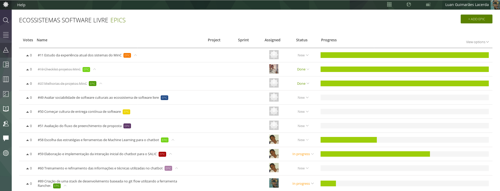
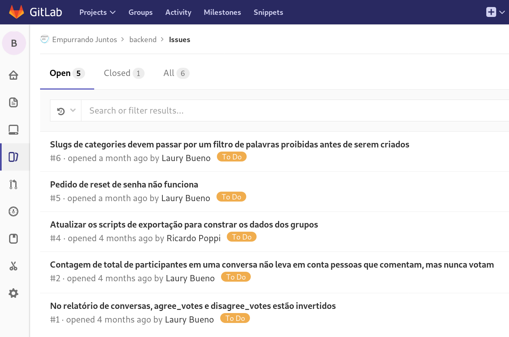

# Metodologia {#sec:metodologia}

Neste Capítulo explicaremos como organizamos todo o ecossistema de colaboradores, as ferramentas que nos auxiliaram e os fundamentos práticos de metodologias de desenvolvimento ágeis que nortearam todo o processo de criação do Empurrando Juntos.

## Comunidade Empurrando Juntos

Este projeto nasceu de uma proposta do Intituto Cidade Democrática a um workshop internacional realizado em Madri, na Espanha. Lá, foram construídos seus primeiros protótipos e discutidas suas principais características por uma equipe composta de cientistas políticos, _designers_, engenheiros de _software_, estudantes, jornalistas e ativistas de diversas nacionalidades. Neste momento, intituiu-se a primeira comunidade em torno do desenvolvimento da plataforma. Figuras importantes, como o cofundador do Pol.is, Colin Megill, e a ministra digital de Taiwan, Audrey Tang, além de todos os participantes do evento, interagiram com nossa equipe e tiveram a um primeiro contato com o arquétipo que originaria o projeto aqui apresentado.

Após o evento, o Instituto Cidade Democrática realizou estudos, testes e pesquisas que fundamentaram a decisão de diversos aspectos conceituais da plataforma. No mesmo período, a interação com a comunidade do Pol.is ganhou contornos estratégicos por meio do trabalho de Martins [-@tall17], que estabeleceu um estudo aprofundado sobre sua arquitetura. Neste contexto, em Agosto de 2017, a Fundação Perceu Abramo, através do projeto "Brasil que o Povo Quer"^[https://brasilqueopovoquer.org], financiou o laboratório de _Software_ Livre Hacklab, de São Paulo, no desenvolvimento da primeira versão oficial do Empurrando Juntos. Este projeto envolveu entre outros participantes, estudantes do curso de Engenharia de _Software_ da Universidade de Brasília. Este foi o marco para o início do presente trabalho.

O contexto específico das primeiras versões do Empurrando Juntos embasou uma série de tomadas de decisão sobre as formas como a ferramenta seria implantada na sociedade. Assim, em Fevereiro de 2018, o Laboratório Avançado de Produção Pesquisa e Inovação em Software (LAPPIS) da Universidade de Brasília e o Instituto Cidade Democrática, em comum acordo com o Hacklab, instauraram a primeira frente de desenvolvimento de um Empurrado Juntos genérico, que pudesse ser aplicado a diferentes contextos sociais.

Atualmente, aproximadamente 40 pessoas de 12 organizações compõem uma comunidade ativa deste _Software_ Livre. Já atuaram em torno de três experimentos e quatro protótipos de teste, que juntos mobilizaram mais de 150 mil votos, realizados por milhares de pessoas.

## Metodologia de desenvolvimento

O deselvolvimento deste trabalho se deu no âmbito do projeto "Brasil que o Povo Quer" do Hacklab. Este projeto mobilizou cerca de 15 pessoas de diferentes perfís trabalhando remotamente em diversas regiões do país. Formou-se uma camada de coordenação que intermediava as discussões com a Fundação Perseu Abramo e então atribuia objetivos de trabalho de curto e médio prazo para as equipes de desenvolvimento.

O projeto e a implementação do _ej-server_ e do _ej-math_ aconteceram em momentos diferentes e guiados por metologias de desenvolvimento distintas. O _App_ de conversas do _django_ foi a primeira entidade a ser projetada e implementada. Esse processo contou com diversos atores que foram responsáveis por, além de auxiliar no desenvolvimento, validar a solução construída e sugerir mudanças e melhorias.

A metodologia utilizada foi fortemente embasada em trabalhos anteriores realizados no Hacklab. Apesar disso, se apoiou inicialmente na primeira experiência do laboratório com a plataforma de gestão de projetos Taiga^[https://taiga.io], mostrada na [@fig:taiga]. As integrações limitadas que essa ferramenta continha, o alto custo operacional de se manter um ambiente completo de gestão atualizado para um contexto relativamente pequenho de desenvolvimento, e outros fatores negativos, culminaram em recursivas defasagens em relação às discussões e imaplementações e, consequentemente, a opção por abandonar a plataforma.

{#fig:taiga}

Para a integração das pessoas, passamos a utilizar extensivamente tecnologias de comunicação ágeis, como a plataforma de mensageria Telegram e os serviços de vídeo conferência Appear^[https://appear.in/] e Google Hangouts^[https://hangouts.google.com]. Essas reuniões eram curtas, realizadas frequentemente para a tomada de decisões estratégicas para o desenvolvimento e também para o rápido alinhamento das diferentes equipes: _designers_, desenvolvedores de _frontend_ e _backend_, coordenadores, etc.

Decidimos utilizar os próprios repositórios remotos para organizar o projeto, simplificando o acesso para os desenvolvedores e agilizando o processo contribuição. Além disso, essa decisão foi tomada em benefício da fomação de uma comunidade de _Software_ Livre transparente e dinâmica, buscando fomentar o ingresso de interessados.

## Gitlab

Para a alocação de tarefas, discussão de problemas e melhorias, e principalmente como repositório remoto Git, utilizamos o serviço Gitlab^[https://gitlab.com/empurrandojuntos/], veja na [@fig:gitlab]. _Issues_ eram criadas e rotuladas de acordo com a importância e as características da tarefa a ser feita. Os coordenadores do projeto indicavam pontos de melhoria, solicitavam novos recursos e validavam as soluções apresentavas através desse sistema.

{#fig:gitlab}

A decisão por utilizar o Gitlab em detrimento do Github partiu do Hacklab e condiz com as práticas adotadas por diversos laboratórios de _Software_ Livre brasileiros, que buscam um opções igualmente Livres para compor seus modelos de negócio. Apesar da menor visibilidade em relação à projetos no Github, por exemplo, há um série de vantagens na escolha dessa ferramenta. Podemos citar as principais:

* _Software_ Livre, distribuído pela licença MIT;
* Serviço de Integração Contínua nativo e ilimitado;
* Serviço de Integração Contínua com suporte para Docker;
* Ambiente integrado ao repositório remoto para registro de imagens Docker;
* Integração nativa com a ferramenta Kubernetes para orquestração de contêineres Docker;

Explicaremos a procura por um ambiente adaptado à infraestruturas projetadas sobre o Docker na [@sec:docker]. Antes, é necessário esclarecer como é realizado o fluxo de alterações no código do Empurrando Juntos.

## Gitflow

Para coordenar o processo de contribuição de cada um dos desenvolvedores, utilizamos o modelo de ramificações do Git (do inglês, _Git Branching Model_) chamado Gitflow. Esse modelo é uma estratégia sistemática de alterações no código, que estabelece um fluxo regular ao qual qualquer modificação no _software_ é submetida. Em outras palavras, ele define uma hierarquia de _branches_ e um caminho que os _commits_ devem seguir passando por elas até o nível mais alto dessa hierarquia, a _branch master_, veja na [@fig:gitflow]. Os dois últimos níveis serão associados aos ambientes de homologação e produção do _software_, falaremos sobre isso na [@sec:integracaocontinua].

![Modelo de Ramificações Gitflow^[Fonte: https://goo.gl/CB6CJP]](images/metodologia/gitflow.png){#fig:gitflow}

O Gitflow nos ajudou a melhorar a organização de duas áreas: a gerencia de configuração e a gerencia de projetos. Através dessa sistematização facilitamos o processo de inclusão e manutenção de código, assim como suavizamos a curva de aprendizado de novos contribuidores, que podem se embasar em diversos casos práticos já documentados na _Internet_ ou optar por utilizar a ferramenta _gitflow_, que foi construída como uma abtração do _git_ para esse modelo de ramificações.

## _Test Driven Development_

O desenvolvimento guiado por testes é um método de desenvolvimento de _software_ baseado em curtos ciclos de repetições em que o desenvolvedor primeiramente escreve um conjunto de testes automatizados que garantam os critérios de aceitação para uma futura melhoria ou funcionalidade e, só então, desenvolve o código que tem como objetivo ser válido para os testes implementados. No contexto desse trabalho, essa técnica foi aplicada principalmente para o desenvolvimento do _ej-math_.

A técnica não foi aplicada por todas as pessoas do time no desenvolvimento dos diferentes _Apps_ do _ej-server_. Inclusive, podemos citar uma defasagem de diversas modelos em relação à implementação de testes automatizados, o que prejudicou algumas tentativas de refatoração e a própria instauração de um processo de Integração Contínua, como veremos na [@sec:integracaocontinua]. Esse estado se agravou de acordo com as dinâmicas de entrega, as pressões por parte dos interessados e o cunjunto reduzido de programadores para a implementação de diversas funcionalidades.

É importante frisar que esse modelo de desenvolvimento oferece mais do que um _framework_ de validação e de correção. Ele pode ser usado para orientar a arquitetura de um _software_. Isso acontece graças ao potêncial de privilegiar a visão das interfaces e integrações, já que para implementar os testes deve-se imaginar como determinada função será utilizada. Essa característica tende a aumentar a conformidade com os requisitos funcinais e não funcionais do sistema.

## Integração Contínua {#sec:integracaocontinua}

Os testes automatizados foram escritos com o auxílio da biblioteca de testes _pytest_ através do pacote _pytest-django_. Este _framework_ facilita a escrita de pequenas unidades de teste, diminuindo o esforço para compreender e desenvolver robustas suítes unitárias e funcionais. Cada conjunto deve ser extendido e aprimorado com o tempo de projeto, de acordo com os trabalhos de implementação e manutenção de funcionalidades.

A elaboração sistemática de testes automatizados possibilita que a integração de diferentes alterações no código sejam realizadas com menor custo operacional. Essa é uma das principais características de metodologias de desenvolvimento ágeis, que se sustentam na utilização de várias tecnologias de apoio ao desenvovlimento de código. Nesse aspecto, as ferramentas empregadas permitiram entregas rápidas, com pequenas e frequentes modificações no _software_. Assim, o trabalho em paralelo dos membros da equipe de desenvolvimento tornou-se não só possível, como incentivado.

O Gitlab possui um sistema nativo de Integração Contínua. Esse sistema permite a execução de rotinas de teste quando detecta uma nova alteração no código. Toda mudança realizada dispara automaticamente o conjunto de testes para aquela versão do código, permitindo que os desenvolvedores tomem ciência imedita sobre falhas e erros que podem ter ocorrido na incorporação daquele novo trecho do programa.

Alinhado aos princípios do Gitflow, assim que um erro é acusado pelos testes, o desenvolvedor responsável deve suspender qualquer pedido de integração com _branches_ de maior hierarquia. Após a análise dos erros e da correção das causas, um novo pedido de integração deve ser realizado. Desta forma, a Integração Contínua é a principal tecnologia de apoio ao fluxo proposto pelo Gitflow, que não deve jamais ser violado nessas circunstâncias.

## Entrega Contínua e _Deploy_ Contínuo

Outra prática adotada foi a Entrega Contínua das alterações realizadas no código. No momento em que as integrações foram testadas e os desenvolvedores entenderam que estão prontas para as validações finais, antes que sejam disponibilizadas aos usuários, é realizado o processo de implantação automatizada do novo _software_ no ambiente de homologação, que antecede o de produção. Isso permite os principais envolvidos no desenvolvimento terem contato imediato com as funcionalidades criadas ou modificadas, de forma que se mantenha ao menos um nível de validações realizadas de forma não automatizada, a fim de perceber possíveis alterações que ainda devem ser feitas.

Após todas alterações, testes e validações, a nova versão do _software_ estará pronta para ser disponibilizada aos usuários finais, no último nível do Gitflow. Então, entra em cena a prática de _Deploy Contínuo_, que pode ser descrita como a realização de um conjunto de tarefas automatizadas que substituem a versão antiga do sistema pela nova no ambiente de produção. Apesar de não serem exclusivos, esses procedimentos foram pensados especialmente para sistemas _Web_, com o intuito de promover a independência dos desenvolvedores em um ecossistema de deselvilvimento ágil. Assim, as diferentes equipes têm capacidade de aplicar suas alterações em produção de forma autônoma, tornando-se diretamentamente responsáveis por questões de qualidade e confiabilidade das funcionalidades que implantaram.

## Docker {#sec:docker}
## Rancher
## Documentação
