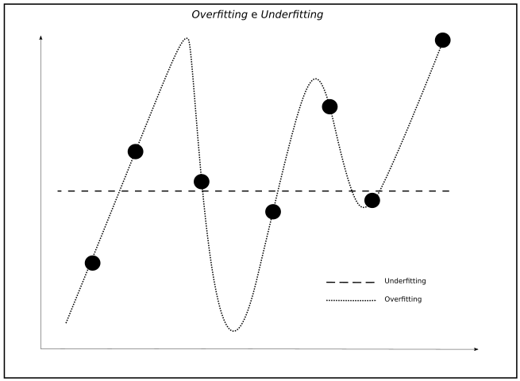

# Aprendizado de Máquina

Muitas pessoas imaginam que Aprendizado de Máquina e Ciência de Dados são fundamentalmente a mesma coisa, e que o trabalho de um cientista de dados é invariavelmente construir, treinar e aprimorar seus modelos de aprendizado. O fato é que essas pessoas não conhecem o que está por trás realmente dessa área bem específica do conhecimento.

Enquanto a Ciência de Dados está intrinsecamente ligada à solução de problemas do mundo real através da coleta, limpeza, formatação e compreensão de dados; o Aprendizado de Máquina se apresenta como uma área do conhecimento que transcende a própria ciência de dados, sendo tipicamente descrita como a "ciência cujo objetivo é usar dados existentes para desenvolver modelos que podemos utilizar para predizer várias características de dados futuros" ([TODO] MLFS)

Podemos assim tratar a Ciência de Dados como um grande guarda-chuvas que compreende um conjunto de disciplinas incluindo _Big Data_, Inteligência Artificial, Mineração de Dados e também o Aprendizado de Máquina, que por si só configura uma vasta área de estudos em modelos preditivos a partir da analise de dados existentes.

Essa área do conhecimento existiu virtualmente por praticamente duas décadas, porém apenas com o advento dos novos computadores, suas capacidades de processamento e armazenamento que veio a se tornar praticamente viável e então, largamente introduzida nos nossos empreendimentos e em nosso dia a dia.

Segundo ([TODO] MLFXB) Os computadores, agora velozes o suficiente, através de um conjunto de algorítimos matemáticos se tornaram capazes de não só produzir, mas transcender tarefas específicas dos humanos. O poder de computação tem feito nossas máquinas e algorítmos se aprimorarem contantemente na identificação de padrões complexos em massivos conjuntos de dados com uma eficiência cada vez maior.

## Classificação dos problemas

Quando falamos de Aprendizado de Máquina estamos englobando centenas de algorítmos que utilizamos para treinar e aprimorar nossos modelos. Entre os algoritmos podemos destacar classificadores bayesianos, análise associativa e redes neurais. Esses algoritmos podem ser divididos em três diferentes categorias: supervisinados, não supervisionados e por reforço. Nesta seção nos aprofundaremos nos dois primeiros tipos.

### Aprendizado supervisionado

Esses algoritmos são guiados por padrões pré-existentes e características já conhecidas. O aprendizado supervisionado se inicia com a apresentação de dados para a máquina já com seus respectivos corretos valores de saída. Então, a partir desse conjunto de informação os algoritmos são capases de decifrar padrões e desenvolver modelos capazes de comparar os resultados obtidos para classificar novos dados.

Para melhor explicar o funcionamento de um algoritmo supervisionado, podemos seguir o exemplo sugerido por ([TODO] MLFXB). Neste temos um problema em separar emails em duas categorias _spam_ e _non-spam_. Precisamos então possuir em mãos uma série de emails que se enquadram nesses dois conjuntos, cada um deles deve ser rotulado respectivamente com o identificador de sua categoria. O algoritmo pode assim compreender as características desses dois conjuntos e então se tornará capaz de discernir o conjunto correspondente a um novo email fornecido e não identificado baseando-se na comparação com os resultados previamente obtidos.

Segundo ([TODO] MLFXB) o grande desafio a ser vencido quando se faz uso desse tipo de algoritmo é se possuir dados rotulados suficientes para representar todas as possíveis variações. Esse conjunto de dados deve além de tudo ser o mais relevante possível, isto é, apresentar as características dos padrões com maior fidelidade e de maneira não viciada.

Regressão linear, _k-nearest neighbors_ e árvores de decisão são exemplos de algoritmos supervisionados.

### Aprendizado não supervisionado

Quando estamos lidando com um problema para o qual não seja possível pré-identificar padrões no conjunto de dados não podemos rotular nossas entidades e então não se é possível utilizar a abordagem supervisionada descrita acima. Nos casos em que nossos dados não possuem padrões conhecidos que podem servir como base para nossas análises, utilizamos então algoritmos não supervisionados. Esses algoritmos são capazes de identificar padrões escondidos no conjunto de dados, portanto não necessitam de dados rotulados.

A ferramenta de participação social Pol.is utiliza o algoritmo _k-means_ para agrupar pessoas de acordo com seus respectivos votos em determinadas questões propostas pelos próprios usuários. Já que os padrões de agrupamento não são conhecidos, podemos afirmar que os usuários de um mesmo grupo possuem caracteristicas semelhantes, entretanto essas caracteristicas continuam ocultas para nós, o que pode ser uma grande desvantagem dependendo do tipo de informação que se deseja obter com a analise desses grupos. Nesse caso, a prática nos diz que sabemos apenas que determinados usuários formam um grupo, o porquê continua sendo um tanto obscuro.

Algoritmos não supervisionados incluem analise de redes sociais, análise associativa e _k-means clustering_. Este último será um objeto importante para nosso estudo de caso, o Empurrando Juntos.

### _Overfitting_ e _Underfitting_

Alguns perigos são bem conhecidos quando falamos de Aprendizado de Máquina, dois deles estão intrinsecamente relacionados a quantidade de informação que nós decidimos analisar em um conjunto de dados.

Podemos descrever um caso de _overfitting_ quando produzimos um modelo que se adequa bem no conjunto de dados que usamos para o treinamento, entretanto está tão rigidamente vinculado a esse conjunto de dados que não é capaz de se generalizar de modo que se possa ralizar predições coerentes para novos dados de entrada. Opostamente, temos também casos de _underfitting_, que podem ser observados quando o modelo que construímos não se adequa bem ao conjunto de dados que utilizamos para o treinamento e consequentemente pode não ser confiável para realizar predições.

### Extração de _features_

## Visualização
### PCA
### TSNE

## Clusterização
### k-means
### outros
